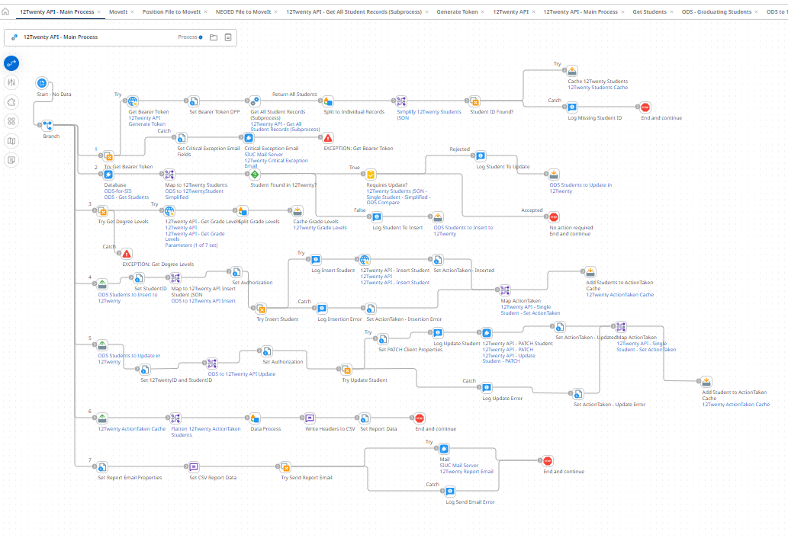
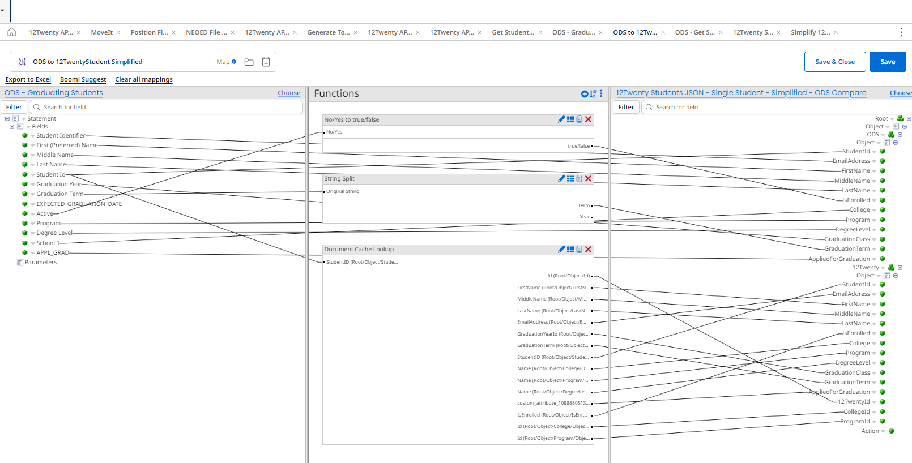

# ODS to 12Twenty - Python Version

## Overview
This program uses python, the HTTP requests library, "requests", and the data analysis/manipulation library, "pandas".  It is currently in the form of a Jupyter Notebook.  The notebook approach is very handy in development since you can run "cells" one at a time and check the data as you go.  In production, this code would run as a simple python script.  Currently, it uses a static version of the ODS data, imported to our DEV SQL Server via SSIS.  However, there is no reason that the python script couldn't just query ODS directly, eliminating the need for SSIS. 

## Instructions
To view notebook with annotations/sample data on Github, open [app.ipynb](./app.ipynb)

To run locally, install VSCode and the Python/Jupyter extensions.  Pull the github repository.  Create a file called api_key.txt next to app.ipynb and paste the 12Twenty API key.  Adjust the SQL Server connection string as needed.  

## Benefits/Context
This code took less than 1 work day to write and is under 100 lines of code.  The equivalent in Boomi took months of frustration.  All included libraries are open source/free.  Although those unfamiliar with python would need time/training to get up to speed, maintaining this process is MUCH simpler than the alternative....

 

